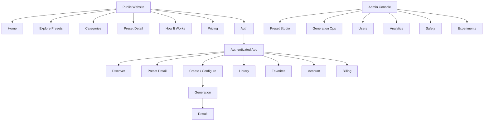
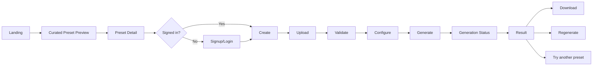
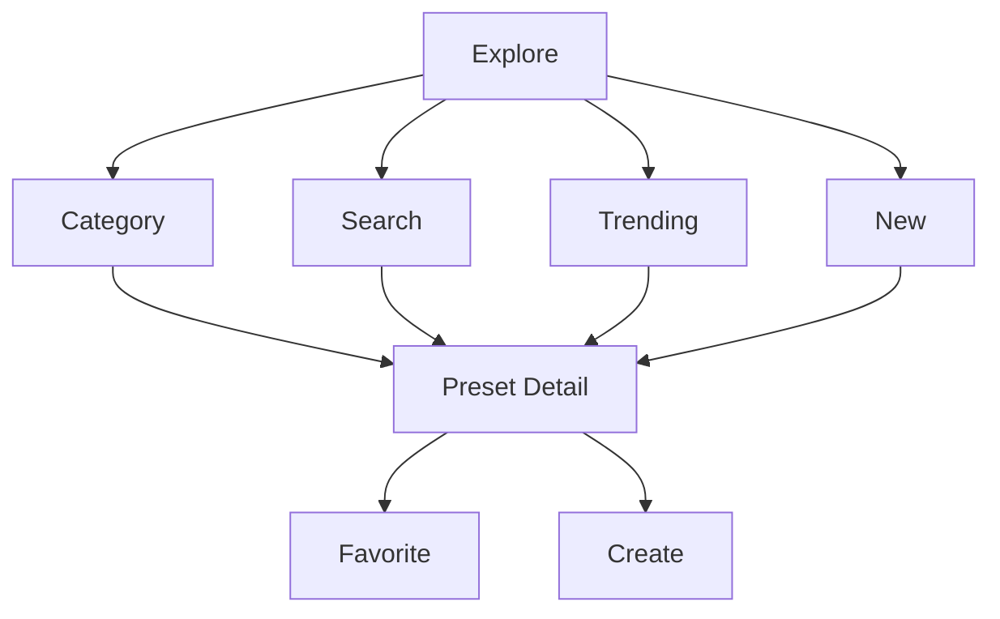
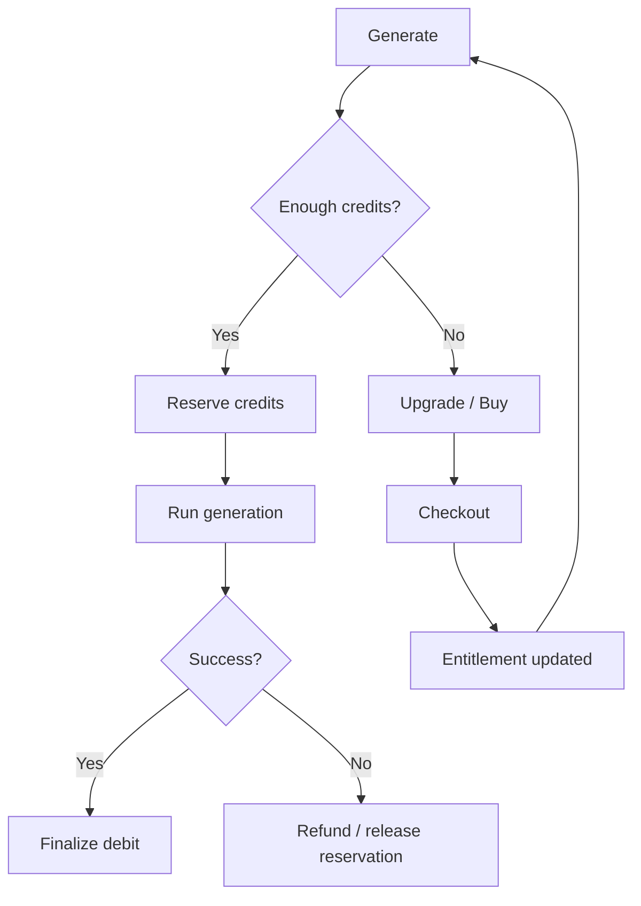
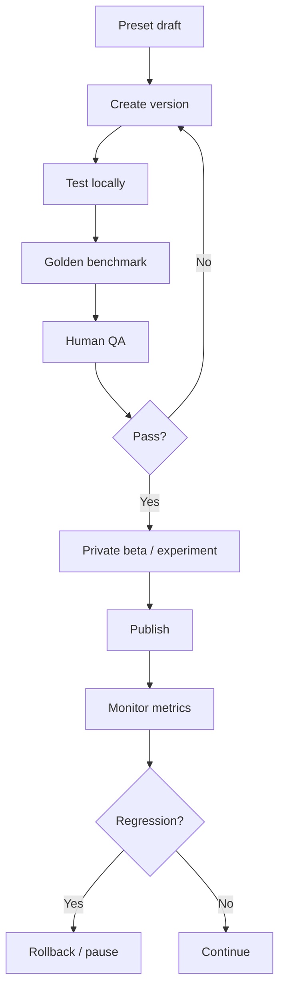

# 5Pixels — Sitemap and Information Architecture

# 1. Top-level sitemap

---

# 2. Public routes

## `/`
Landing page.

## `/explore`
Primary preset discovery page.

Sub-filters:
- trending;
- new;
- portraits;
- cinematic;
- covers;
- illustration;
- professional;
- retro;
- fantasy;
- seasonal.

Potential URL:
`/explore?category=cinematic&sort=trending`

## `/categories`
Category index.

## `/categories/[slug]`
Category landing page.

Examples:
- `/categories/portrait`
- `/categories/cinematic`
- `/categories/covers`

## `/presets/[slug]`
Public preset detail page.

Unauthenticated users can:
- preview;
- read compatibility;
- view examples;
- click Try this look.

The CTA routes through auth if necessary.

## `/how-it-works`
Optional dedicated marketing page.

## `/pricing`
Plans, credits, FAQ.

## `/login`
## `/signup`
## `/forgot-password`
## `/verify-email`

## `/legal/privacy`
## `/legal/terms`
## `/legal/cookies`
## `/legal/content-policy`
## `/legal/license`

---

# 3. Authenticated application routes

## `/app`
Authenticated discovery home.

Contains:
- continue recent work;
- trending;
- recommended;
- favorites preview;
- new presets.

## `/app/explore`
Full catalog.

## `/app/presets/[slug]`
Authenticated preset detail.

Includes:
- credit cost;
- use preset;
- favorite;
- examples;
- compatibility.

## `/app/create/[presetSlug]`
Preset configuration workflow.

Panels:
- source upload;
- source preview;
- preset controls;
- crop/aspect options if allowed;
- generation summary;
- credit cost;
- Generate CTA.

## `/app/generations/[generationId]`
Live generation status page.

May automatically transition to result page.

## `/app/results/[generationId]`
Result page.

## `/app/library`
User generation history.

Filters:
- all;
- saved;
- downloaded;
- date;
- preset.

## `/app/favorites`
Saved presets.

## `/app/account`
Profile/account overview.

Sub-pages:
- `/app/account/profile`
- `/app/account/security`
- `/app/account/privacy`
- `/app/account/notifications`

## `/app/billing`
Plan, credits, invoices.

Sub-pages:
- `/app/billing/plan`
- `/app/billing/credits`
- `/app/billing/history`

---

# 4. Internal/admin routes

Recommended separate path and permissions.

## `/admin`
Operations home.

## `/admin/presets`
Preset list.

Filters:
- draft;
- testing;
- scheduled;
- active;
- paused;
- retired.

## `/admin/presets/new`
Create preset.

## `/admin/presets/[id]`
Preset overview.

Tabs:
- Overview
- Version history
- Public content
- Inputs
- AI recipe
- Reference assets
- Routing
- Post-processing
- Tests
- Analytics
- Publishing
- Audit log

## `/admin/preset-versions/[versionId]`
Version detail.

## `/admin/benchmarks`
Golden dataset and evaluation runs.

## `/admin/generations`
Generation operations.

Filters:
- failed;
- blocked;
- slow;
- refunded;
- provider;
- preset.

## `/admin/generations/[id]`
Detailed job trace.

## `/admin/users`
User search.

## `/admin/users/[id]`
Account status, entitlement, generation summary, support actions.

## `/admin/safety`
Safety event review.

## `/admin/experiments`
Experiment creation and analysis.

## `/admin/analytics`
Product/preset dashboards.

## `/admin/system`
Provider status, queues, feature flags, configuration.

---

# 5. Global overlays and pop-ups

## Search palette
Triggered from nav.

Provides:
- preset search;
- category search;
- recent searches.

## Authentication modal
Optional fast login/signup overlay from public pages.

Can route to full page if needed.

## Upload source chooser
Sources:
- device;
- recent uploads later;
- camera/mobile capture later.

## Credit confirmation modal
Shown only when helpful.

Example:
"This transformation costs 2 credits."

Do not force confirmation for every generation if user has already accepted pricing patterns.

## Insufficient credits modal
Actions:
- buy credits;
- upgrade plan;
- cancel.

## Generation failure dialog
Explain refund/retry.

## Share result modal
Channels:
- copy link if public sharing exists later;
- download;
- native share on supported devices.

## Delete asset confirmation
Explicit destructive modal.

## Report result modal
Optional moderation/report flow.

## Billing upgrade modal
Can be launched from locked preset or insufficient credits.

---

# 6. Drawers / sheets

Mobile-first:
- category filter sheet;
- preset controls;
- generation options;
- billing summary;
- result actions.

Desktop may use side panels for:
- filter controls;
- create configuration;
- admin preset editor.

---

# 7. Main user journey relationship

---

# 8. Preset discovery relationship

---

# 9. Billing relationship

---

# 10. Admin publishing relationship

---

# 11. Navigation rules

Public:
- brand logo always returns home;
- Explore is prominent;
- Pricing always accessible;
- login and CTA visible.

Authenticated:
- Discover;
- Explore;
- Library;
- Favorites;
- credits indicator;
- account menu.

Admin:
- entirely separate nav and visual treatment;
- role-gated;
- never discoverable to normal users.

---

# 12. Required URL properties

- stable slugs;
- canonical URLs for presets;
- generation/result IDs must be unguessable;
- no private storage URLs in public route parameters;
- private instructions never appear in page source.

---

# 13. 404 / edge pages

Required:
- 404;
- expired shared link;
- unavailable preset;
- retired preset;
- generation not found;
- access denied;
- billing checkout cancelled;
- maintenance/degraded service.

Retired preset page should usually suggest alternatives rather than dead-end.
