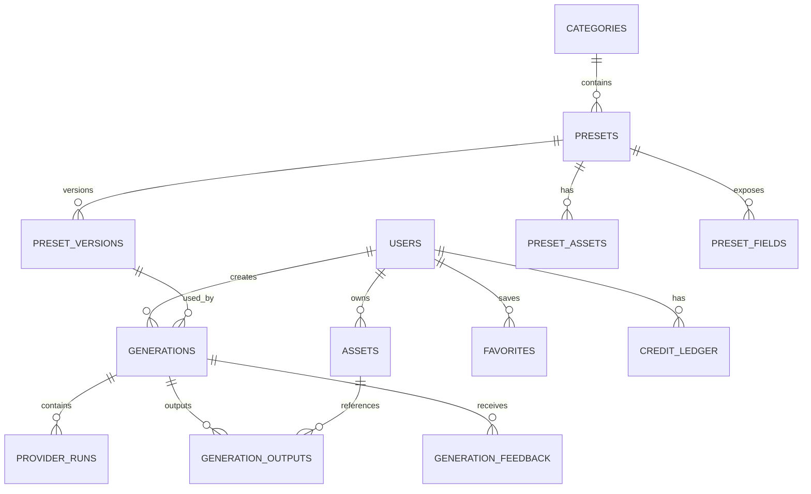

# 5Pixels — Data Schema and Database Model

# 1. Database choice

Recommended primary relational database: PostgreSQL.

Reasons:
- strong transactions;
- JSONB where flexible preset schema is useful;
- relational integrity for billing and versions;
- mature indexing;
- analytics export compatibility.

---

# 2. High-level ER model

---

# 3. Users

`users`
- id UUID PK
- email
- display_name
- avatar_asset_id nullable
- status
- locale
- timezone
- created_at
- updated_at
- deleted_at nullable

Never store passwords if auth provider handles them externally.

---

# 4. User profiles/settings

`user_settings`
- user_id PK/FK
- default_download_format
- marketing_opt_in
- product_updates_opt_in
- auto_delete_originals_days nullable
- created_at
- updated_at

---

# 5. Categories

`categories`
- id
- slug unique
- name
- description
- hero_asset_id
- sort_order
- is_active
- created_at
- updated_at

---

# 6. Presets

`presets`
- id
- slug unique
- name
- short_description
- long_description
- category_id
- public_status
- visibility
- hero_asset_id
- poster_asset_id
- preview_video_asset_id
- preview_gif_asset_id nullable
- likeness_level
- featured_rank nullable
- metadata JSONB
- created_at
- updated_at

---

# 7. Preset versions

`preset_versions`
- id
- preset_id
- version_number
- state
- private_instruction_template encrypted/secured
- private_negative_instruction nullable
- provider_strategy JSONB
- model_config JSONB
- input_validation_config JSONB
- post_process_config JSONB
- safety_config JSONB
- credit_cost integer
- evaluation_profile_id nullable
- created_by_admin_id
- created_at
- published_at nullable
- retired_at nullable

Unique:
`(preset_id, version_number)`

---

# 8. Preset fields

`preset_fields`
- id
- preset_id
- field_key
- label
- help_text
- field_type
- required
- sort_order
- config JSONB
- validation JSONB
- active

A version-specific schema snapshot should be stored with `preset_versions` or versioned table if field semantics can change.

---

# 9. Preset assets

`preset_assets`
- id
- preset_id
- preset_version_id nullable
- asset_id
- role
- sort_order
- internal_only
- rights_metadata JSONB
- created_at

Roles:
- hero
- poster
- preview_video
- preview_gif
- example_source
- example_result
- style_reference
- composition_reference
- layout_reference

---

# 10. Assets

`assets`
- id
- owner_user_id nullable
- storage_provider
- storage_key
- bucket
- media_type
- mime_type
- width nullable
- height nullable
- duration_ms nullable
- bytes
- checksum
- visibility
- source_type
- metadata_stripped boolean
- moderation_status
- retention_expires_at nullable
- created_at
- deleted_at nullable

Never store a public permanent URL as the source of truth.

---

# 11. Generations

`generations`
- id
- user_id
- preset_id
- preset_version_id
- source_asset_id
- status
- requested_options JSONB
- compiled_request_fingerprint
- credit_reservation_id nullable
- failure_code nullable
- failure_stage nullable
- started_at nullable
- completed_at nullable
- created_at

Statuses:
- created
- uploaded
- validating
- queued
- generating
- post_processing
- completed
- failed
- blocked
- cancelled

---

# 12. Provider runs

`provider_runs`
- id
- generation_id
- attempt_number
- provider
- model
- model_revision nullable
- external_request_id nullable
- status
- request_metadata JSONB
- response_metadata JSONB
- input_cost_micros
- output_cost_micros
- total_cost_micros
- latency_ms
- error_code nullable
- created_at
- completed_at nullable

Do not store private raw prompts in normal observability logs. If retained for controlled debugging, use restricted encrypted storage with limited retention.

---

# 13. Generation outputs

`generation_outputs`
- id
- generation_id
- asset_id
- output_role
- width
- height
- file_format
- is_primary
- created_at

Possible roles:
- primary
- alternative
- thumbnail
- preview
- composed_final

---

# 14. Generation feedback

`generation_feedback`
- id
- generation_id
- user_id
- sentiment
- reason_code nullable
- free_text nullable
- created_at

Reason codes:
- likeness
- style
- text
- artifact
- composition
- other

---

# 15. Favorites

`favorites`
- user_id
- preset_id
- created_at

Unique:
`(user_id, preset_id)`

---

# 16. Credit ledger

`credit_ledger`
- id
- user_id
- entry_type
- amount integer
- currency_unit = credits
- generation_id nullable
- subscription_id nullable
- purchase_id nullable
- idempotency_key unique
- metadata JSONB
- created_at

Positive:
- allocation
- purchase
- refund
- adjustment

Negative:
- reservation/debit depending ledger model

Recommended approach:
use reservation records plus finalization, or explicit hold ledger.

---

# 17. Subscriptions

`subscriptions`
- id
- user_id
- billing_provider
- external_customer_id
- external_subscription_id
- plan_id
- status
- current_period_start
- current_period_end
- cancel_at_period_end
- created_at
- updated_at

---

# 18. Plans

`plans`
- id
- code
- name
- billing_interval
- price_minor
- currency
- included_credits
- entitlements JSONB
- is_active
- sort_order

---

# 19. Credit purchases

`credit_purchases`
- id
- user_id
- product_code
- credits
- price_minor
- currency
- billing_provider_payment_id
- status
- created_at

---

# 20. Safety events

`safety_events`
- id
- user_id nullable
- generation_id nullable
- source_asset_id nullable
- policy_version
- event_type
- severity
- automated_decision
- reviewer_decision nullable
- metadata JSONB
- created_at
- reviewed_at nullable

---

# 21. Preset evaluations

`evaluation_profiles`
- id
- name
- weights JSONB

`benchmark_runs`
- id
- preset_version_id
- dataset_version
- model_config
- status
- aggregate_scores JSONB
- created_at

`benchmark_samples`
- id
- benchmark_run_id
- source_asset_id
- output_asset_id
- automated_scores JSONB
- human_scores JSONB
- notes

---

# 22. Experiments

`experiments`
- id
- name
- status
- allocation_config JSONB
- metric_config JSONB
- started_at
- ended_at

`experiment_assignments`
- experiment_id
- user_id
- variant
- created_at

---

# 23. Audit logs

`admin_audit_logs`
- id
- admin_user_id
- action
- entity_type
- entity_id
- before JSONB
- after JSONB
- created_at

Required for:
- preset publish;
- rollback;
- user credit adjustment;
- safety override;
- subscription admin action.

---

# 24. Indexing recommendations

Indexes:
- presets slug;
- active/category;
- generations user_id + created_at;
- generations status + created_at;
- provider_runs generation_id;
- assets owner_user_id;
- credit_ledger user_id + created_at;
- favorites user_id;
- safety_events status/severity;
- preset_versions preset_id + version_number.

---

# 25. Data isolation

Every private user asset lookup must enforce:
- owner match;
- authorized admin role;
- temporary signed-access grant.

Never trust client-provided user IDs.

---

# 26. Deletion model

Soft deletion:
- users;
- presets;
- certain audit-relevant records.

Hard/physical deletion:
- user media after retention/deletion workflow where legally permitted;
- temporary assets.

Billing/audit records may require retention independent of media deletion.

---

# 27. Schema design rule

Any value that affects reproducibility of a generation must be persisted or fingerprinted:
- preset version;
- model;
- reference assets;
- user options;
- post-processing;
- provider attempt;
- source asset version.
