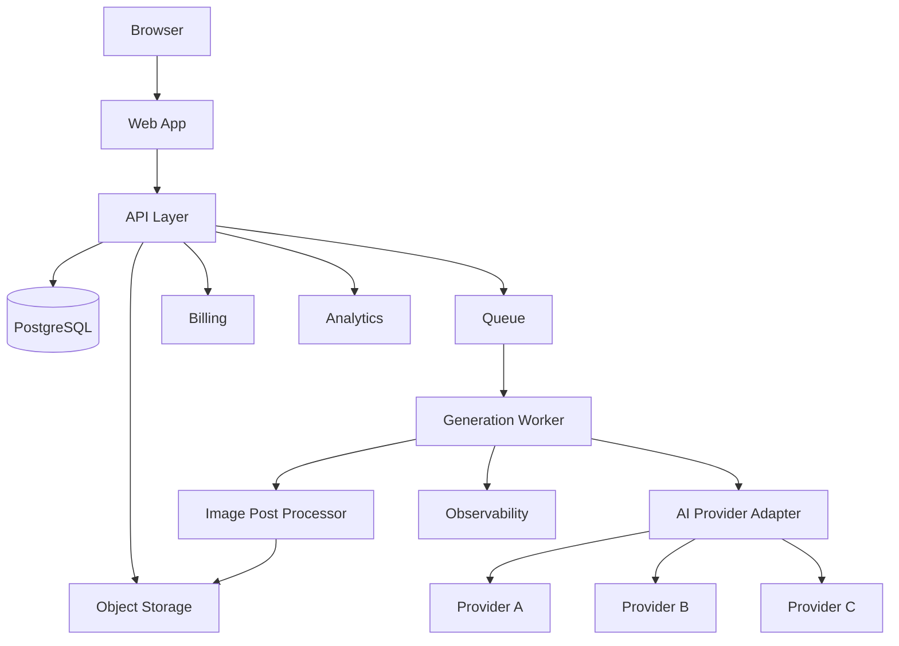
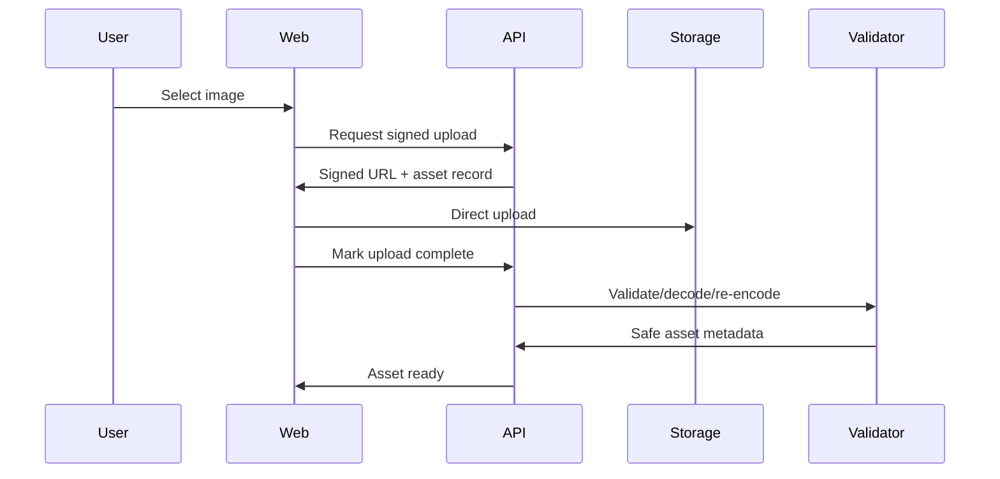

# 5Pixels — Backend, API, and System Architecture

# 1. Suggested V1 stack

Reasonable starting stack:
- Next.js + TypeScript for web;
- PostgreSQL;
- object storage compatible with S3;
- CDN;
- background job runner / durable queue;
- server-side image processing via Sharp/libvips;
- Stripe or equivalent billing provider;
- PostHog or equivalent analytics;
- Sentry or equivalent error monitoring.

Vendor choices may change. Architecture should not depend on a single implementation.

---

# 2. High-level architecture



---

# 3. Service domains

## Identity
- auth;
- sessions;
- user profile;
- role.

## Catalog
- categories;
- presets;
- preset detail;
- search;
- collections.

## Assets
- signed upload;
- validation;
- metadata;
- private access;
- deletion.

## Generation
- create;
- validate;
- reserve credits;
- queue;
- status;
- outputs;
- retries.

## Billing
- plan;
- credits;
- checkout;
- webhook;
- ledger.

## Admin
- preset editing;
- publishing;
- benchmark;
- operations.

---

# 4. API style

Either:
- REST with typed OpenAPI contracts;
- or typed RPC in monorepo.

Important properties:
- explicit authorization;
- idempotency;
- structured errors;
- no private instruction payloads returned to client.

---

# 5. Example public API domains

`GET /api/presets`
- filters;
- category;
- pagination.

`GET /api/presets/:slug`
- public metadata;
- compatibility;
- fields;
- previews.

`POST /api/assets/upload-url`
- returns signed upload info.

`POST /api/generations`
- preset;
- source asset;
- selected options;
- idempotency key.

`GET /api/generations/:id`
- state;
- user-safe error;
- result references.

`POST /api/generations/:id/regenerate`

`POST /api/generations/:id/feedback`

`POST /api/presets/:id/favorite`
`DELETE /api/presets/:id/favorite`

---

# 6. Asset upload flow



---

# 7. Why direct-to-storage upload

Avoid routing large media through normal app server where possible.

Benefits:
- lower memory use;
- better throughput;
- easier scaling;
- resumable options later.

---

# 8. Generation request

Client sends:
- preset identifier;
- source asset ID;
- user configuration;
- idempotency key.

Server:
1. authorizes asset ownership;
2. resolves active preset version;
3. validates inputs;
4. calculates cost;
5. reserves credits;
6. creates generation;
7. queues job;
8. returns generation ID.

---

# 9. Job queue

Generation is asynchronous.

Worker responsibilities:
- acquire job;
- check status/idempotency;
- validate source;
- safety checks;
- compile preset;
- call provider;
- poll/wait;
- handle transient failures;
- post-process;
- store outputs;
- finalize ledger;
- update state;
- emit analytics.

---

# 10. Generation state machine

```text
CREATED
-> VALIDATING
-> QUEUED
-> GENERATING
-> POST_PROCESSING
-> COMPLETED
```

Terminal:
- FAILED
- BLOCKED
- CANCELLED

Status transitions should be validated server-side.

---

# 11. Idempotency

Required for:
- generation create;
- checkout create;
- webhook processing;
- credit purchases;
- admin adjustments.

Double clicks must not double charge or create unintended duplicate jobs.

---

# 12. Error taxonomy

User-safe:
- invalid_image;
- incompatible_image;
- insufficient_credits;
- generation_failed;
- generation_blocked;
- service_busy;
- result_expired.

Internal:
- provider_timeout;
- provider_rate_limit;
- provider_validation;
- storage_error;
- post_process_error;
- queue_timeout;
- moderation_provider_error.

Never show raw provider stack traces.

---

# 13. Provider adapters

Interface example:

```ts
interface ImageProviderAdapter {
  generate(input: CompiledGenerationInput): Promise<ProviderResult>
  checkStatus?(requestId: string): Promise<ProviderResult>
  cancel?(requestId: string): Promise<void>
}
```

Compiled input should be provider-neutral before adapter conversion.

---

# 14. Storage

Buckets/logical prefixes:
- user-originals/private;
- sanitized-inputs/private;
- generation-output/private;
- public-preset-assets/public or CDN;
- internal-reference-assets/private;
- temporary/private.

Use signed URLs for private delivery.

---

# 15. CDN

Public:
- preset posters;
- preview videos;
- marketing images.

Private outputs:
- signed CDN URL if supported.

---

# 16. Post-processing pipeline

Possible functions:
- orientation normalization;
- EXIF removal;
- format conversion;
- exact text composition;
- resizing;
- thumbnails;
- web preview;
- download-quality export.

Keep original AI output for debugging/quality if policy permits, with controlled retention.

---

# 17. Caching

Cache:
- public preset catalog;
- category pages;
- plan metadata;
- static marketing data.

Do not cache private user generation responses in shared caches without correct controls.

---

# 18. Real-time status

Options:
- polling initially;
- Server-Sent Events;
- WebSockets later.

Polling every 2–5 seconds is acceptable V1 if efficient.

---

# 19. Webhooks

Billing webhooks:
- signature verify;
- idempotent;
- raw event archival as permitted;
- async processing.

AI provider webhooks:
- only if supported and reliable;
- verify signature;
- map external request to provider run.

---

# 20. Observability

Track:
- job latency;
- queue wait;
- provider latency;
- provider error;
- post-process error;
- credit mismatch;
- storage failure;
- generation completion;
- p50/p95/p99.

Alerts:
- error rate spike;
- queue backlog;
- provider degradation;
- credit ledger invariant failure.

---

# 21. Feature flags

Use for:
- new preset versions;
- model migration;
- pricing experiments;
- preview autoplay;
- new categories;
- fallback routing.

---

# 22. V1 scaling posture

Do not prematurely build microservices.

Recommended:
- modular monolith web/API;
- separate worker process;
- PostgreSQL;
- queue;
- object storage;
- provider adapters.

Split services only when operational need is proven.

---

# 23. Security rule

The browser must never receive:
- private preset instructions;
- provider API keys;
- internal reference assets unless they are intentionally public;
- unrestricted storage credentials;
- admin-only generation traces.
